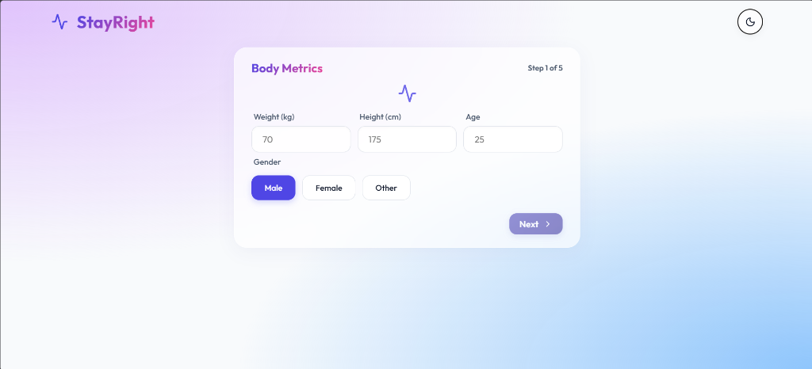
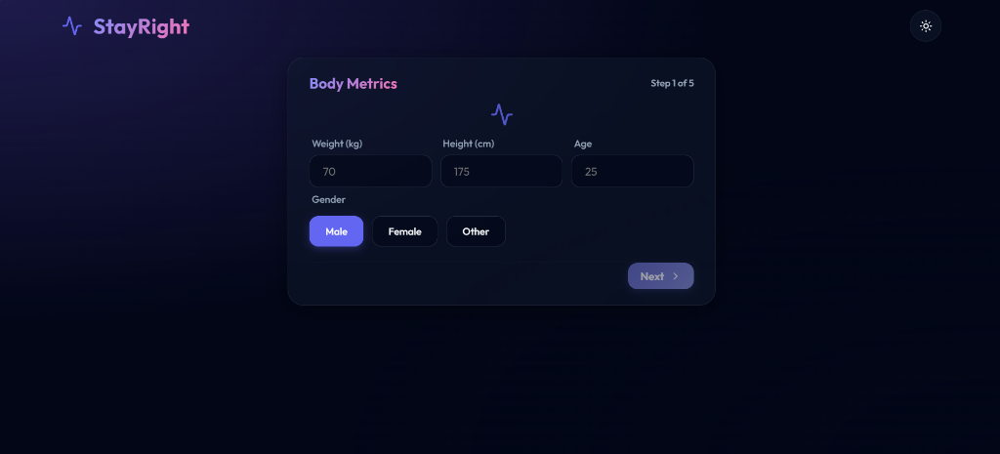
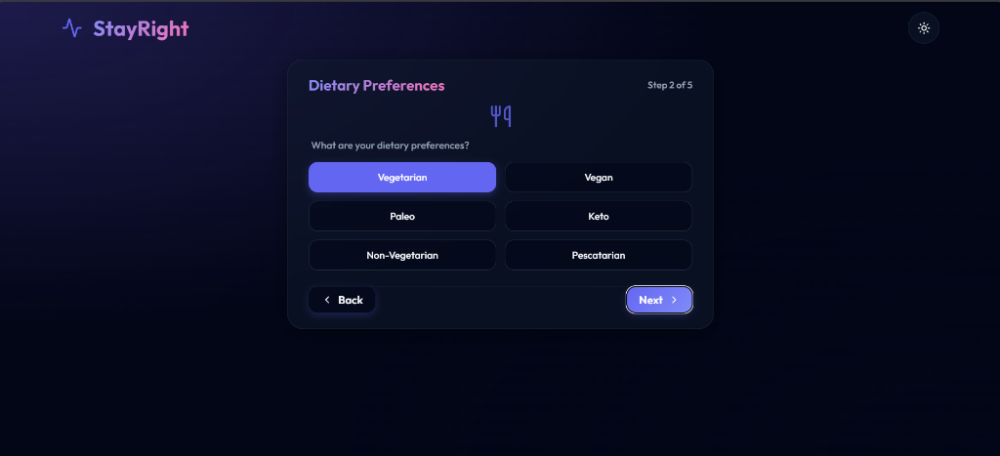
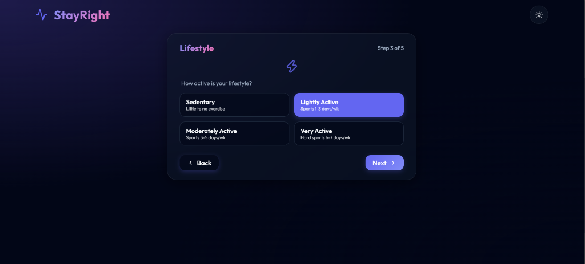
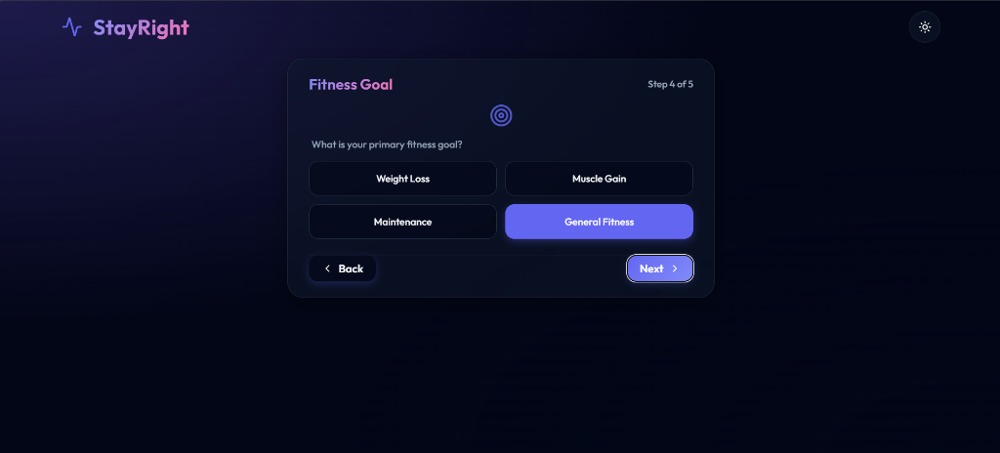
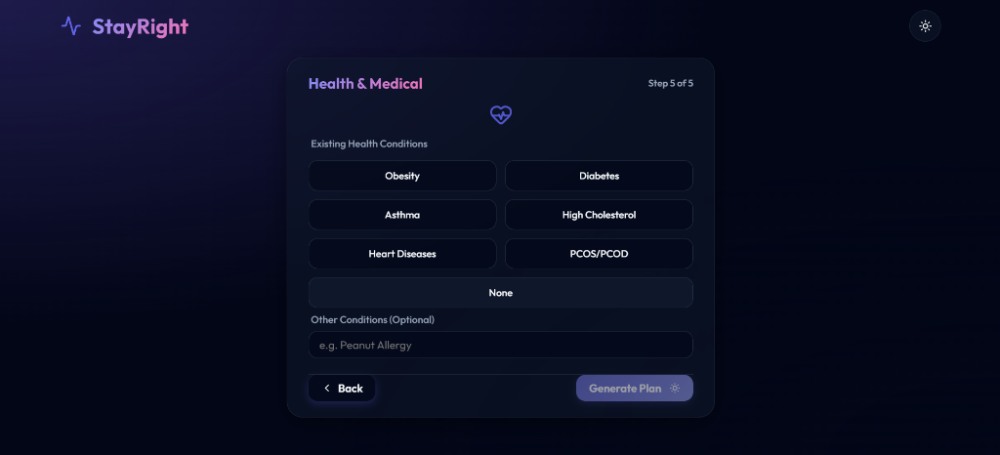
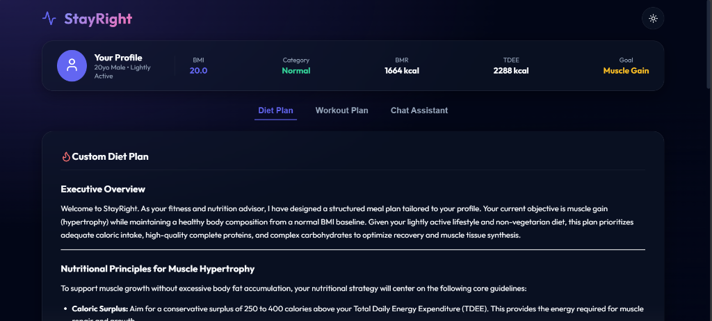
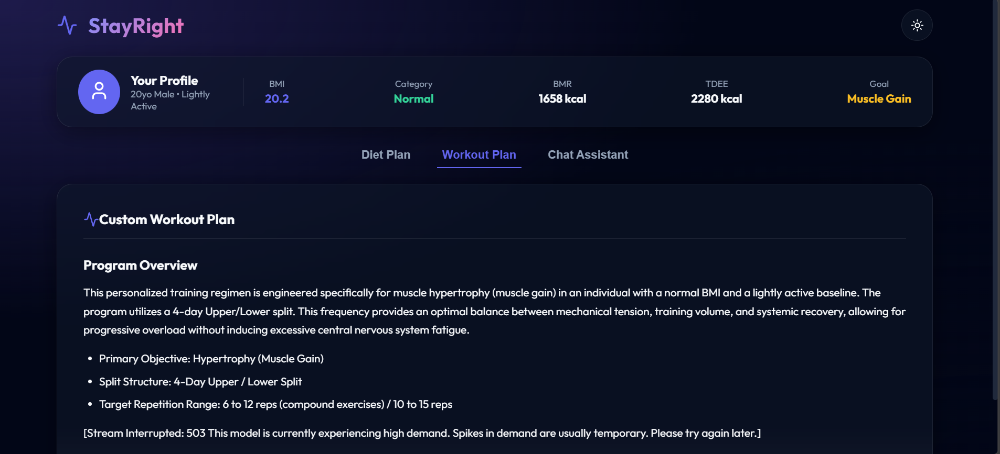
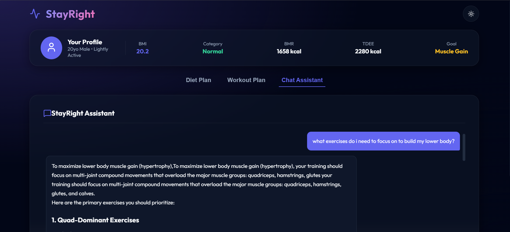
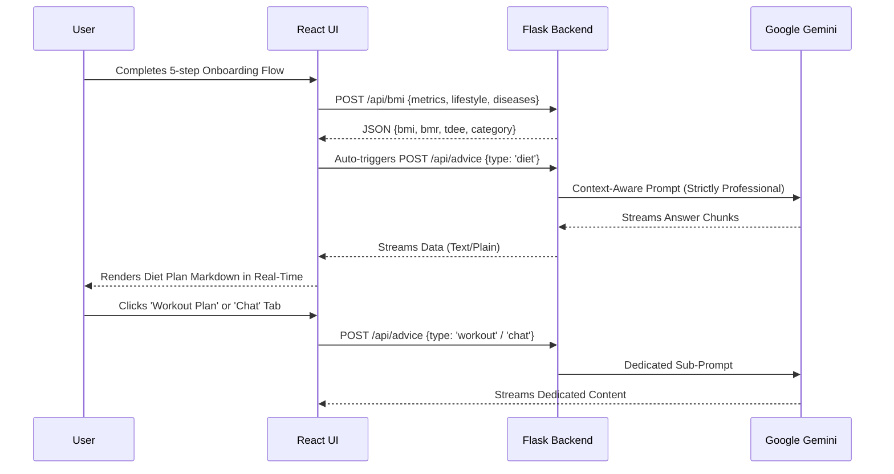

<div align="center">
  
  
  <h1>StayRight</h1>

  **Your Intelligent, Real-Time Fitness & Nutrition Companion**
  
  <p align="center">
    <a href="https://react.dev/"></a>
    <a href="https://flask.palletsprojects.com/"></a>
    <a href="https://python.org"></a>
    <a href="https://ai.google.dev/"></a>
  </p>

  <p align="center">
    <i>StayRight (formerly FitMate) transforms standard health metrics into highly personalized, streaming fitness and dietary advice using the power of Google Gemini AI.</i>
  </p>
</div>

<br />

> **Research Implementation**
> 
> This project is the modern technology stack migration (React + Python) of the core architecture described in the research paper: *"FitMate AI-Powered Fitness Companion", Patidar et al., IEEE ICTBIG 2024*.

---

## Features

- **Comprehensive Health Metrics:** Instantly calculates your BMI, BMR (Mifflin-St Jeor), and Total Daily Energy Expenditure (TDEE).
- **AI-Powered Tabbed Architecture:** Dedicated AI-generated tabs for your Custom Diet Plan, Custom Workout Plan, and an interactive Chat Assistant.
- **Real-Time Streaming:** AI responses are streamed directly to the UI, providing an ultra-fast, professional experience with built-in multi-model fallback.
- **Premium UI:** A stunning frontend featuring a multi-step onboarding wizard, responsive glass-panel aesthetics, and a global Dark/Light mode toggle.
- **Health Condition Aware:** The AI strictly tailors advice to respect existing diseases (like PCOS, Diabetes, Asthma, or Heart Disease) and dietary preferences (Vegan, Paleo, etc.).

---

## Quick Start

Get StayRight running locally in under 2 minutes.

### 1️. Clone & Configure Backend
```bash
# Clone the repository
git clone https://github.com/Inferno2176/AICIA5FitMate.git
cd AICIA5FitMate

# Setup Backend Environment
cd backend
echo 'GEMINI_API_KEY="your-gemini-api-key"' > .env
pip install -r requirements.txt
python app.py
```

### 2️. Start the Frontend
Open a new terminal in the project root:
```bash
cd frontend
npm install
npm run dev
```
Navigate to `http://localhost:5173` in your browser!

---

## Screenshots

### Light and Dark theme
<p align="center">
  
</p>
  
### Multi-Step Onboarding
<p align="center">
  
  
  
  
  
</p>

### Tabbed Dashboard & AI Engine
<p align="center">
  
  
  
</p>

---

## Architecture Flow



<details>
<summary><b>Click to view how the code maps to the research paper architecture</b></summary>
<br/>

- **Data Collection Module:** Implemented via the sleek React `<Onboarding />` wizard which captures age, weight, height, lifestyle, and diseases.
- **Decision Engine (Rule-based):** `calculate_bmr` and `calculate_tdee` in `backend/app.py` process the physical parameters deterministically.
- **Generative AI Module:** Implemented via `google-generativeai` utilizing `gemini-3.6-flash` as the core reasoning engine.
- **User Interface Layer:** React Vite app running a custom glassmorphism design system in `index.css`.
</details>

---

## 🛠️ Built With
- **Frontend:** React 18, Vite, Lucide React (Icons), React Markdown
- **Backend:** Python 3, Flask, Flask-CORS
- **AI Integration:** Google Generative AI Python SDK
